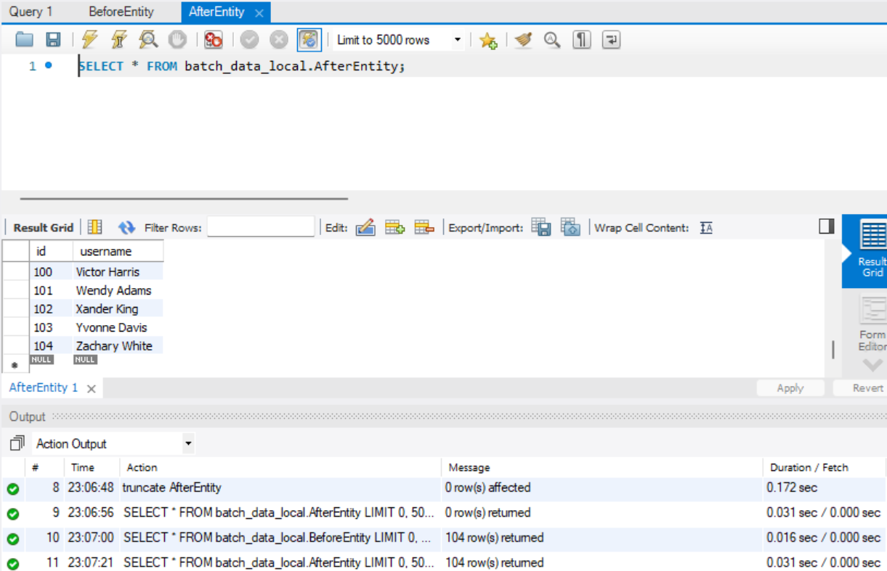

# Spring Batch5
배치 공부용  

1️⃣ 목표 : Spring batch5 framework를 활용하여 스프링 생태계에서 대량의 데이터를 안전하게 처리할 수 있는 기본적인 환경을 구축한다.


### 배치(batch)란?

사전적 의미로 ‘**일정 시간동안 대량의 데이터를 한번에 처리하는 방식**’을 의미한다.

처리하는 중간에 프로그램이 멈출 수 있는 상황을 대비해 안전 장치를 마련하기 위해 프레임워크를 사용한다.

10만개의 데이터를 복잡한 JOIN을 걸어 이동시키다가 프로그램이 멈춘다해서 처음부터 다시 시작할 수는 없다. 작업 지점을 기록해야한다.


스케줄 기반 실행, 웹 핸들 기반 실행

### 버전 및 의존성

- Spring Boot 3.3.1, Spring Batch 5.x, Spring Data JPA
- JDBC API(MySQL), Java 17 (Gradle)
- Lombok


### 스프링 배치 동작 방식

1. 처리 전의 데이터를 읽어 온다.
2. 처리자를 통해 처리한다.
3. 쓰기 작업으로 처리한 데이터를 기록한다.  
  
  
이렇게 하나의 배치 작업으로, 읽을 데이터가 없을때까지 반복한다.

**작업을 중복하지 않도록 어디까지 작업했는지 파악**하는 것이 가장 중요하다고 생각한다.  
배치는 보통 주기적으로 스케줄러에 잡혀 실행되기 때문
</div></div>
**한번에 모두 읽어오지 않는 이유는?**

- 양이 많아서 메모리에 올리지 못할 수도 있다.
- 실패 했을 때 위험성이 크고 속도적인 문제점도 발생하기 때문에, 대량의 데이터를 끊어서 읽는다.  
  


## 스프링 배치의 내부 구조도


JobLauncher : 하나의 배치 작업(Job)을 실행시키는 시작점

Job : (읽기 → 처리 → 쓰기) 과정을 정의한 배치 작업

Step : 실제 하나의 작업을 정의하는 부분으로, 1개의 Job에서 여러 과정을 진행할 수 있기 때문에 1:N 구조를 가진다.

ItemReader : 읽기 작업

ItemProcessor : 처리 작업

ItemWriter : 쓰기 작업

JobRepository : “메타 데이터”에 기록하는 레포지토리
</div></div></div>  

### 들어가기 앞서,

배치의 자동 실행을 방지하기 위해서 `application.properties`에서 다음 설정을 추가해야한다.

```jsx
spring.batch.job.enabled=false
```

스프링 배치는 1개의 배치 작업에 대해 프로젝트를 실행하면 자동으로 가동되기 때문에 우선 해당 과정을 막아야한다.

</div></div>  
메타데이터용 DB와 배치 처리 데이터용 DB로 분리해서 진행

- 배치 작업의 진행 상황 및 내용에 대한 메타데이터를 기록하는 테이블을 위한 DB
- 배치 작업 데이터용 DB
</div></div></div>
스프링 부트는 하나의 데이터베이스에 대해서만 변수 방식으로 자동 연결을 진행하기 때문에, 2개 등록시 진행하는 Config 클래스 파일을 작성해야함.

```jsx
spring.datasource-meta.driver-class-name=com.mysql.cj.jdbc.Driver
spring.datasource-meta.jdbc-url=jdbc:mysql://localhost:3306/batch-meta?useSSL=false&useUnicode=true&serverTimezone=Asia/Seoul&allowPublicKeyRetrieval=true
spring.datasource-meta.username=아이디
spring.datasource-meta.password=비밀번호

spring.datasource-data.driver-class-name=com.mysql.cj.jdbc.Driver
spring.datasource-data.jdbc-url=jdbc:mysql://localhost:3306/batch-data?useSSL=false&useUnicode=true&serverTimezone=Asia/Seoul&allowPublicKeyRetrieval=true
spring.datasource-data.username=아이디
spring.datasource-data.password=비밀번호
```

</div></div></div>
### 메타 데이터 테이블

배치에서 중요한 작업에 대한 tracking을 수행하는 테이블. 

여기서 진행중인 작업, 했던 작업을 기록하는 테이블을 **메타 테이터**라고 명명한다.

메타 데이터의 존재 이유 : **특정 일에 했던 처리를 중복하는 불상사를 막기 위한 이유**
- 주기별 회원 권한 조정(구독 서비스)
- 급여, 주기별 보고서
- 데이터 삭제
- 은행 이자 시스템 - 매일 자정 전일 데이터를 기반으로 이자를 계산해서 지급

</div></div>
보통 DB 테이블에 저장하며, @Primary로 설정한 테이블에 자동으로 생성

- application.properties 수정

```jsx
spring.batch.jdbc.initialize-schema=always
spring.batch.jdbc.schema=classpath:org/springframework/batch/core/schema-mysql.sql
```

always로 설정하면 batch 설정에서 jdbc를 통해 테이블을 생성한다.

생성 쿼리는 연결된 DB를 파악한 뒤 자동으로 찾지만 classpath 값을 부여해서 명시적으로 지정할 수도 있다.  

  

그냥 docker-compose로 생성하고 명령어로 직접 생성해줬다.  


  

메타데이터의 테이블이 자동으로 잘 생성되었음을 mysql workbench로 확인.

자세한 설명은 [공식 문서](https://docs.spring.io/spring-batch/reference/schema-appendix.html)에 있다.
</div></div></div>  

### 실습1 - 2개의 테이블간의 데이터 이동

beforeEntity,Repository와 AfterEntity,Repository를 생성해두고

- 미리 beforeEntity에 실습 데이터를 넣는다.

JobLauncher가 작업을 시작하고 Job, Step 이하에서 작업을 수행한다.

JobRepository가 계속해서 메타 데이터 테이블에 접근하면서 작업이 얼만큼 진행되었는지 기록한다.

```jsx
@Configuration
@AllArgsConstructor
public class FirstBatch {
    private final JobRepository jobRepository;
    private final PlatformTransactionManager platformTransactionManager;

    private final BeforeRepository beforeRepository;
    private final AfterRepository afterRepository;

    @Bean
    public Job firstJob(){
        System.out.println("first job");

        return new JobBuilder("firstJob", jobRepository)
                .start(step)
                .next()
                .next()
                ...
                .build();
    }
}
```
</div></div></div>
Step에서 “읽기 → 처리 → 쓰기” 과정을 구상해야한다.

```jsx
@Bean
public Step firstStep(){
	return new StepBuilder("firstStep", jobRepository)
		.<BeforeEntity,AfterEntity> chunk(10,platformTransactionManager)
		.reader(읽는 메소드)
		.processor(처리 메소드)
		.writer(쓰기 메소드)
		.build();
	}
```

**청크(chunk)**

- 읽기→처리→쓰기 작업은 청크 단위로 진행된다.
- 대량의 데이터를 얼만큼 끊어서 처리할지에 대한 값을 선정해야합니다.

너무 적으면 IO 처리가 많아지고 오버헤드가 발생한다.

반대로, 너무 크면 적재 및 리소스 비용과 실패시 부담이 커진다.

`platformTransactionManager`는 청크가 진행되다가 실패했을때, 롤백하던 다시 처리할 수 있도록 해준다.
</div></div></div> 

### Read → Process → Write 작성

아주 다양한 Reader 인터페이스들의 구현체가 존재하지만, JPA를 통해 쿼리를 수행하기 때문에 `RepositoryItemReader`를 사용한다.

**Read**

```jsx
    @Bean
    public RepositoryItemReader<BeforeEntity> beforeReader(){
        return new RepositoryItemReaderBuilder<BeforeEntity>()
                .name("beforeReader")
                .pageSize(10)
                .methodName("findAll")
                .repository(beforeRepository)
                .sorts(Map.of("id", Sort.Direction.ASC))
                .build();
    }
```

- 청크 단위까지 읽기 때문에, findAll이라 하더라도 chunk 개수만큼만 처리한다.

- 자원 낭비를 막기 위해 Sort를 진행해서 pageSize() 단위를 설정해 findAll이 아닌 페이지만큼 읽어오도록 설정

**Processor**

- 읽어온 데이터를 처리하는데, 큰 작업을 수행하지 않는 경우 생략 가능

```jsx
    @Bean
    public ItemProcessor<BeforeEntity, AfterEntity> middleProcessor(){
        return new ItemProcessor<BeforeEntity, AfterEntity>() {
            @Override
            public AfterEntity process(BeforeEntity item) throws Exception {
                AfterEntity afterEntity = new AfterEntity();
                afterEntity.setUsername(item.getUsername());

                return afterEntity;
            }
        };
    }
```

</div></div>

**Writer**

```jsx
    @Bean
    public RepositoryItemWriter<AfterEntity> afterWriter() {

        return new RepositoryItemWriterBuilder<AfterEntity>()
                .repository(afterRepository)
                .methodName("save")
                .build();
    }
```

- Writer도 다양한 인터페이스가 존재하지만 JPA의 `RepositoryItemWriter`를 사용

- 스케줄 단위나 웹에서 API 요청을 통해 실행되도록 구성  

</div></div></div>

**웹 API 요청 - batchController.java**

```jsx
    @GetMapping("/batch1")
    public String firstAPI(@RequestParam("value") String value) throws  Exception{
        JobParameters jobParameters = new JobParametersBuilder()
                .addString("date",value)
                .toJobParameters();

        jobLauncher.run(jobRegistry.getJob("firstJob"),jobParameters );
        return "ok";
    }
```

- 동기적으로 요청하기에 지연이 생길 수 있다. (callable 등 비동기 요청도 괜찮다.)

</div></div>

**@EnableScheduling로 스케쥴러 실행 - SchedulerConfig.java**

main 클래스에서 `@EnableScheduling`스케쥴러 활성화

```jsx
    @Scheduled(cron = "10 * * * * *", zone = "Asia/Seoul")
    public void runFirstJob() throws Exception {

        System.out.println("first schedule start");

        SimpleDateFormat dateFormat = new SimpleDateFormat("yyyy-MM-dd-hh-mm-ss");
        String date = dateFormat.format(new Date());

        JobParameters jobParameters = new JobParametersBuilder()
                .addString("date", date)
                .toJobParameters();

        jobLauncher.run(jobRegistry.getJob("firstJob"), jobParameters);
    }
```

JobParameter를 주는 이유는 실행한 작업에 대한 일자, 순번 등을 부여해서 동일한 작업의 수행 여부를 확인해 중복을 방지한다.

AfterEntity에 마이그레이션이 진행되는 것을 볼 수 있고, truncate를 통해 지우면서 진행.

</div></div>

```jsx
Unexpected error occurred in scheduled task
JobInstanceAlreadyCompleteException: A job instance already exists and is complete for identifying parameters={'date':'{value=2024-08-11-11, type=class java.lang.String, identifying=true}'}.If you want to run this job again, change the parameters.
```  
지금은 `hh-mm-ss`까지 date를 받아서 계속 마이그레이션하는거다.  

`SimpleDateFormat dateFormat = new SimpleDateFormat("yyyy-MM-dd-hh");`


- 매일 받도록 수정해서 테스트해본 결과, 마이그레이션을 진행하지 않는다.


</div>  </div></div>


### 결과
  

동일한 date로 이미 완료된 작업 인스턴스가 존재한다.

다만, 중복해서 같은 내용을 추가로 넣기에 좀 더 다듬을 필요가 있음


### 영속성별 구현법

각 저장소 및 인터페이스(MongoDB, Redis, Jdbc) 배치 구현 방법에 대해 공식 코드를 살펴보자.

Processor는 데이터베이스나 인터페이스에 상관없기 때문에 생략

JDBC

- Cusor

  전체 테이블에서 DB 자체의 cursor가 한 칸씩 이동하여 데이터를 가져옴

- Page

  묶음 단위로 데이터를 가져오는 방식으로 SQL 구문 생성시 offset, limit을 배치단에서 자동으로 조합해서 쿼리를 전송
